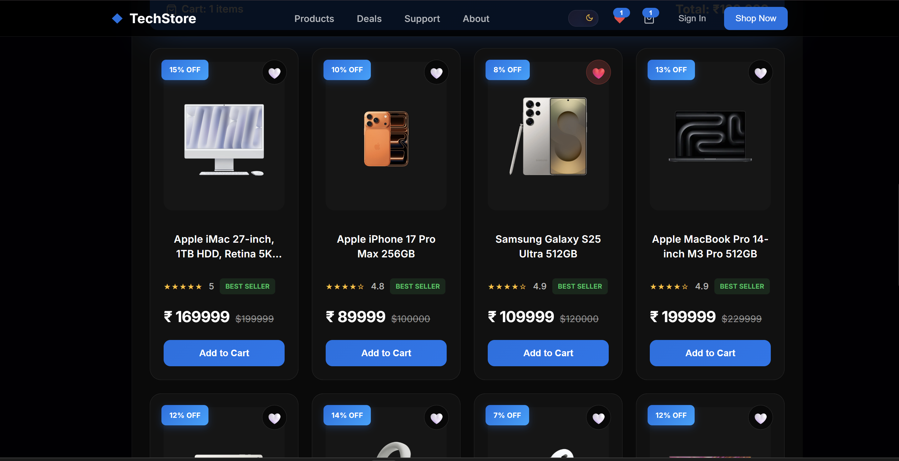
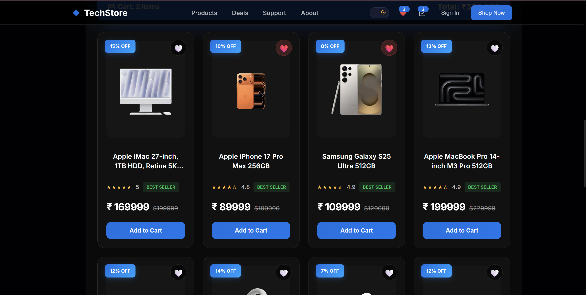

# 🛒 Tech Store React

A modern and responsive e-commerce web application built with **React** and **Vite**. The application enables users to browse electronic products, search and filter items, sort products by price or rating, manage a shopping cart and wishlist, and switch between light and dark themes. Cart data is persisted using Local Storage for a seamless user experience.

## 🌐 Live Demo

👉 https://tech-store-react-pink.vercel.app

## 📸 Screenshots

### 🏠 Home Page


### 🛍️ Products


### 🛒 Shopping Cart


### ❤️ Wishlist


### 🌙 Light Mode


---

## ✨ Features

- 🛍️ Browse electronic products
- 🔍 Search products by name
- 🎯 Filter products by brand
- ↕️ Sort products by price and rating
- 🛒 Add, update, and remove items from the shopping cart
- ❤️ Add and remove wishlist items
- 🌙 Light/Dark mode toggle
- 💾 Cart persistence using Local Storage
- 📱 Responsive user interface

---

## 🛠️ Tech Stack

- React.js
- JavaScript (ES6+)
- HTML5
- CSS3
- Vite
- Local Storage

---

## 📂 Project Structure

```text
tech-store-react
├── public/
├── screenshots/
├── src/
│   ├── assets/
│   ├── components/
│   │   ├── CartSidebar.jsx
│   │   ├── Footer.jsx
│   │   ├── Hero.jsx
│   │   ├── Navbar.jsx
│   │   ├── ProductCard.css
│   │   ├── ProductCard.jsx
│   │   ├── ProductFilters.jsx
│   │   └── ProductGrid.jsx
│   ├── App.css
│   ├── App.jsx
│   ├── data.js
│   ├── index.css
│   └── main.jsx
├── .gitignore
├── eslint.config.js
├── index.html
├── package-lock.json
├── package.json
├── README.md
└── vite.config.js
```

---

## 🚀 Run Locally

```bash
git clone https://github.com/Arshu01/tech-store-react.git

cd tech-store-react

npm install

npm run dev
```

---

## 🔮 Future Enhancements

- 🔐 User Authentication
- 📄 Product Details Page
- 💳 Checkout Process
- 📦 Order History
- ☕ Spring Boot REST API
- 🗄️ MySQL Database
- 💰 Payment Gateway Integration

---

## 👨‍💻 Author

**Shaik Arshad Valli**

- GitHub: https://github.com/Arshu01
